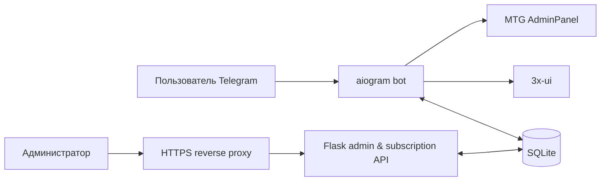

# MyVlessBot

[](https://github.com/Bogdan199719/myvlessbottg/actions/workflows/validate.yml)
[](LICENSE)

Telegram-бот для продажи VPN и Telegram Proxy: веб-админка, SQLite и автоматическая выдача доступов через 3x-ui и MTG AdminPanel.

> Для production обязателен домен с HTTPS: subscription-ссылки и Happ deeplink используют ваш `DOMAIN`. Docker намеренно публикует приложение только на `127.0.0.1:1488`; наружу его должен отдавать reverse proxy.

## Возможности

- основной Telegram-бот на `aiogram 3` и отдельный support-бот с forum topics;
- Flask-админка: пользователи, тарифы, хосты, платежи, резервные копии и статистика;
- единая VPN-подписка `ALL` со ссылкой `/sub/...` на все активные XUI-хосты;
- `⚡ Автовыбор`, мониторинг здоровья хостов и настраиваемый IP-лимит 3x-ui;
- VPN trial, Telegram Proxy через MTG, YooKassa, Telegram Stars, CryptoBot и ручной P2P;
- фоновые уведомления, синхронизация с панелями и восстановление неполной выдачи доступа.

## Как это устроено



## Быстрый старт

Требования: Docker Compose, домен с настроенной DNS-записью и доступные порты `80`/`443` для HTTPS.

### Автоматическая установка на Ubuntu/Debian

Скрипт установит зависимости, запросит конфигурацию, настроит Nginx и Let's Encrypt:

```bash
git clone https://github.com/Bogdan199719/myvlessbottg.git
cd myvlessbottg
bash install.sh
```

Запускайте его на чистом сервере с правом `sudo`. Перед запуском убедитесь, что DNS домена уже указывает на сервер.

### Ручной запуск

```bash
git clone https://github.com/Bogdan199719/myvlessbottg.git
cd myvlessbottg
cp .env.example .env
chmod 600 .env
# Заполните минимум TELEGRAM_BOT_TOKEN, ADMIN_TELEGRAM_ID, DOMAIN,
# FLASK_SECRET_KEY, PANEL_LOGIN и PANEL_PASSWORD.
docker compose up -d --build
curl -fsS http://127.0.0.1:1488/healthz
```

Затем настройте Nginx или Caddy перед контейнером. Готовый пример Nginx, TLS и порядок обновления описаны в [руководстве по деплою](docs/deployment.md#reverse-proxy-и-https).

После первого запуска приложение создаёт или мигрирует `users.db` и переносит стартовые значения из `.env` в `bot_settings`. Админка доступна по `https://<DOMAIN>/login`; используйте `PANEL_LOGIN` и `PANEL_PASSWORD` из первоначального `.env`. Дальнейшие рабочие настройки редактируются в админке.

## Проверка перед выкладкой

В контейнере уже есть runtime-зависимости проекта:

```bash
docker compose exec -T bot python3 -m compileall -q src scripts
docker compose exec -T bot python3 scripts/check_callbacks.py
docker compose exec -T bot python3 scripts/check_subscription_business_rules.py
docker compose exec -T bot python3 scripts/check_subscription_consistency.py
```

Полный список проверок и назначение каждой команды — в [deployment guide](docs/deployment.md#проверки-перед-деплоем). Проверка consistency по умолчанию маскирует Telegram ID и usernames; `--show-identities` используйте только при доверенной локальной диагностике.

## Документация

- [Архитектура](docs/architecture.md) — модули, данные и интеграции.
- [Сценарии бота](docs/bot-flow.md) — путь пользователя, trial, оплата и поддержка.
- [Админ-панель](docs/admin-panel.md) — разделы и действия с production-эффектом.
- [Деплой](docs/deployment.md) — HTTPS, backup/restore, обновление и проверки.
- [Переменные окружения](docs/env.md) — `.env` и настройки `bot_settings`.
- [История аудитов](docs/codebase-audit.md) — исправления и известные ограничения.

## Структура

- `src/shop_bot/bot/` — пользовательский и support-боты;
- `src/shop_bot/data_manager/` — SQLite, миграции и scheduler;
- `src/shop_bot/modules/` — интеграции 3x-ui и MTG;
- `src/shop_bot/webhook_server/` — админка и subscription API;
- `scripts/` — проверки и обслуживание;
- `docs/` — эксплуатационная документация.

## Безопасность и данные

Не публикуйте `.env`, `users.db`, backup-файлы, токены или пароли. Они исключены из Git; права на `.env` должны быть `600`. Уязвимости не публикуйте в Issues — используйте порядок из [SECURITY.md](SECURITY.md).

Лицензия: [GPL-3.0](LICENSE).
